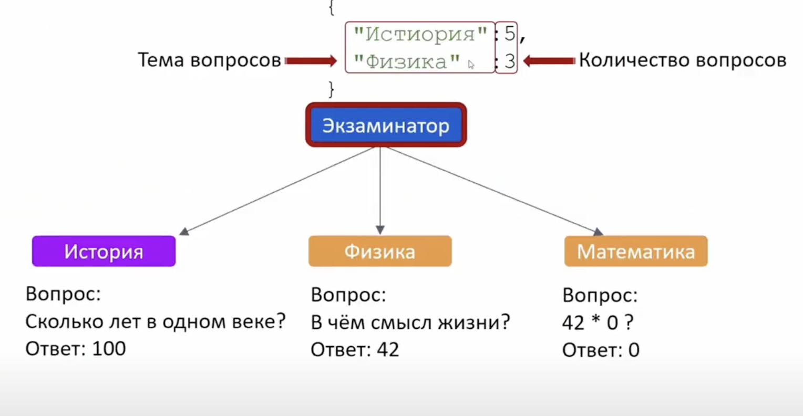
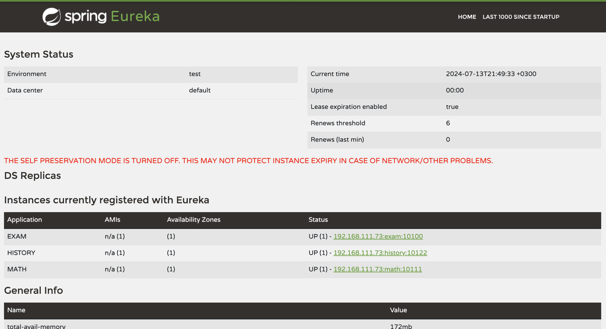

# EXAM-CLOUD prototype

This project is a prototype of Exam system.
It shows how works discovery server (Eureka), how exam service ask `math` & `history` services a data (questions).



## Discovery services

- Eureka server :  http://localhost:10761/

## Micro services:

### 1. MATH - mathematics service

### 2. History service

### 3. Discover - service discovering

### 4. physic (not implemented yet)

---

## #help urls

### eureka server

- http://localhost:10761/



### POST exam example:

```
    POST http://localhost:10100/exam
    
    Body: JSON 
    {
        "MATH": 3,
        "HISTORY": 2
    }
```

### GET MATH example:

```
    GET http://localhost:10111/api/questions?amount=3
```

### GET HISTORY example:

```
    GET http://localhost:10122/api/questions?amount=3
```
